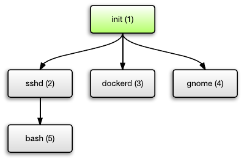
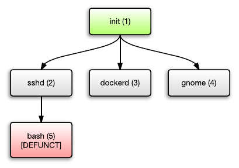
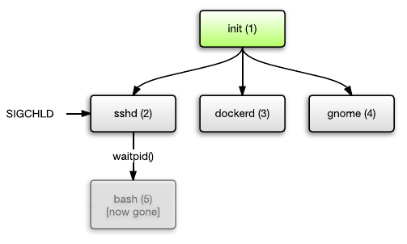
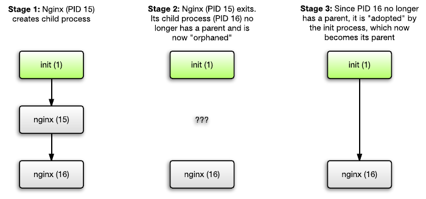

### PID 1 Problem - reaping zombies

You can find original blog post at

[Docker and the PID 1 zombie reaping problem](https://blog.phusion.nl/2015/01/20/docker-and-the-pid-1-zombie-reaping-problem/)

Unix processes are ordered in a tree. Each process can spawn child processes, and each process has a parent except for the top-most process.

This top-most process is the init process. It is started by the kernel when you boot your system.

This init process is responsible for starting the rest of the system, such as starting the SSH daemon, starting the Docker daemon, starting Apache/Nginx, starting your GUI desktop environment, etc. Each of them may in turn spawn further child processes.

But consider what happens if a process terminates. Let's say that the bash (PID 5) process terminates. It turns into a so-called "defunct process", also known as a "zombie process".

Why does this happen? It's because Unix is designed in such a way that parent processes must explicitly "wait" for child process termination, in order to collect its exit status. The zombie process exists until the parent process has performed this action, using the waitpid() family of system calls.

The action of calling waitpid() on a child process in order to eliminate its zombie, is called "reaping". Many applications reap their child processes correctly. In the above example with sshd, if bash terminates then the operating system will send a SIGCHLD signal to sshd to wake it up. Sshd notices this and reaps the child process.

And this is where the init process kicks in. The init process -- PID 1 -- has a special task. Its task is to "adopt" orphaned child processes (again, this is the actual technical term). This means that the init process becomes the parent of such processes, even though those processes were never created directly by the init process.

Relationship with Docker
So how does this relate to Docker? Well, we see that a lot of people run only one process in their container, and they think that when they run this single process, they're done. But most likely, this process is not written to behave like a proper init process. That is, instead of properly reaping adopted processes, it's probably expecting another init process to do that job, and rightly so.

This problem applies to other situations too. We see that people often create Docker containers for third party applications -- let's say PostgreSQL -- and run those applications as the sole process inside the container. You're running someone elses code, so can you really be sure that those applications don't spawn processes in such a way that they become zombies later? If you're running your own code, and you've audited all your libraries and all their libraries, then fine. But in the general case you should run a proper init system to prevent problems.
